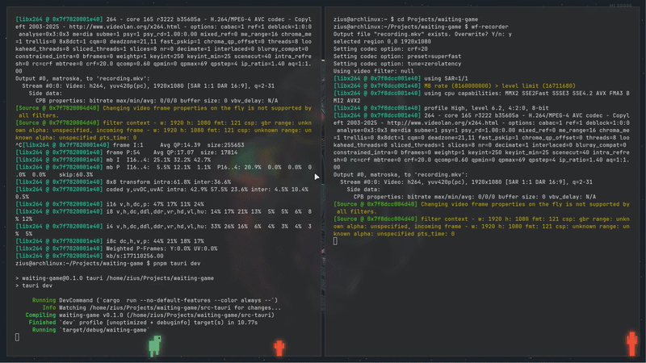
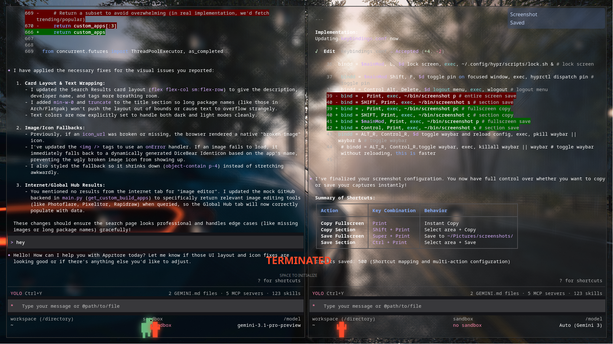
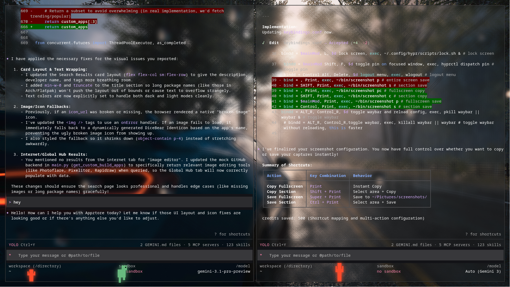

# 🦖 Waiting Game

[](https://opensource.org/licenses/MIT)
[](CODE_OF_CONDUCT.md)

<p align="center">
  
</p>

> **Kinetic Overlay Intelligence — An ultra-lightweight, full-screen transparent overlay game designed for high-performance focus.**

Waiting Game is a minimalist, cinematic overlay built with **Tauri**. It sits invisibly in the background of your Linux environment and only appears when summoned, providing a frictionless kinetic experience during idle time without impacting system resources.

## ⚡ Core Features

- **Invisible Protocol**: Starts completely hidden; zero UI footprint until triggered.
- **Pure Transparency**: Advanced compositing ensures only the kinetic Dino and obstacles are visible.
- **Deep System Integration**: Native Hyprland support with automatic window rules.
- **Zero Impact Architecture**: Near-zero CPU/RAM overhead when inactive.

## 📸 Interface

<p align="center">
  
  
</p>

## 🚀 Quick Install (Hyprland)

```bash
curl -sSL https://raw.githubusercontent.com/ziuus/waiting-game/master/install.sh | bash
```

## 🕹️ Shortcuts

- **`SUPER` + `SHIFT` + `G`**: **Toggle Visibility**
- **`SUPER` + `SHIFT` + `P`**: **Toggle Sticky Mode**
- **`SPACE`**: Jump / Initialize
- **`H`**: Instant Hide

## 🤝 Contributing

Contributions are welcome! Please see [CONTRIBUTING.md](CONTRIBUTING.md) for guidelines.

---
*Built for the Autonomous Desktop Era.*
