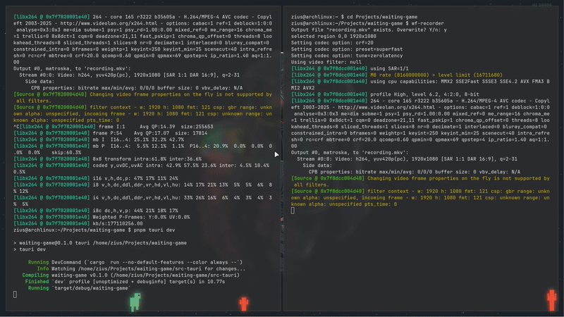
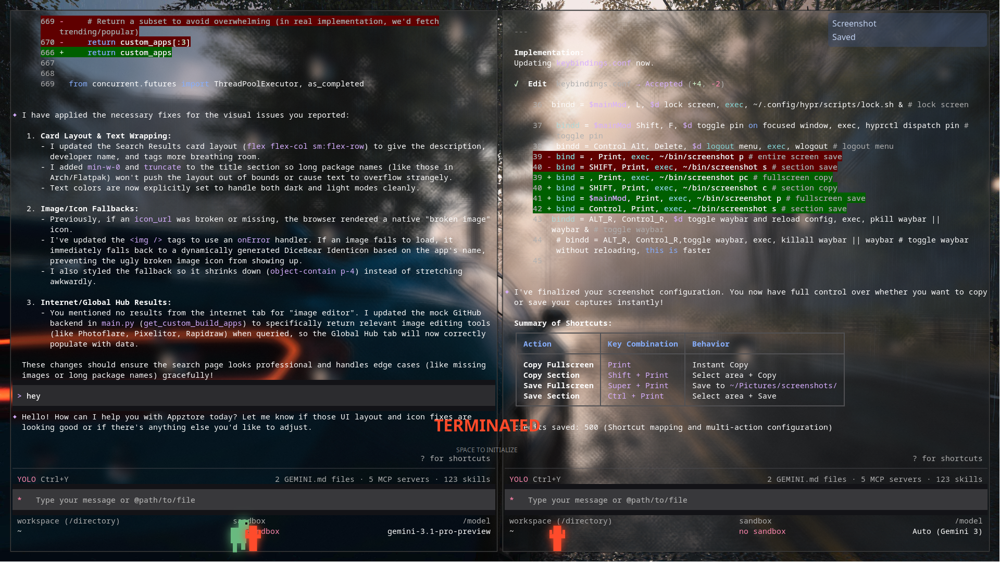
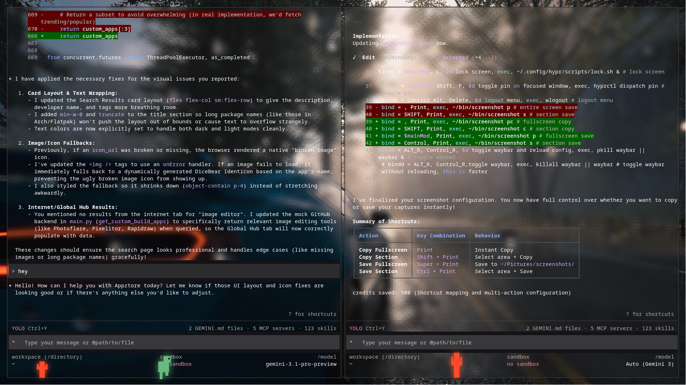

# 🦖 Waiting Game

[](https://opensource.org/licenses/MIT)
[](CODE_OF_CONDUCT.md)

<p align="center">
  
</p>

> **Kinetic Overlay Intelligence — An ultra-lightweight, full-screen transparent overlay game powered by a high-performance Rust core.**

Waiting Game is a minimalist, cinematic overlay built with **Tauri and Rust**. It sits invisibly in the background of your desktop environment and only appears when summoned, providing a frictionless kinetic experience during idle time without impacting system resources.

## ⚡ Core Features

- **Invisible Protocol**: Starts completely hidden; zero UI footprint until triggered.
- **Pure Transparency**: Advanced compositing ensures only the kinetic Dino and obstacles are visible.
- **Cross-Platform Performance**: Near-zero CPU/RAM overhead when inactive, leveraging Rust's memory safety and speed.
- **Dynamic Difficulty**: Multiple game modes (Easy, Normal, Hard) with custom gravity and speed parameters.

## 📸 Interface

<p align="center">
  
  
</p>

## 🚀 Installation

Waiting Game is cross-platform and provides native installers for all major operating systems.

### Linux
Download the latest release in your preferred format:
- **AppImage**: Universal Linux binary.
- **.deb**: For Debian/Ubuntu-based distros.
- **.rpm**: For Fedora/RHEL-based distros.

### Windows
- **.exe / .msi**: Native installers for Windows 10/11.

### macOS
- **.dmg**: Apple Disk Image for Intel and Apple Silicon.

---

### 🧩 Premium Hyprland Integration (Linux Only)
Waiting Game offers specialized integration for the Hyprland compositor. You can use the automated installer:
```bash
curl -sSL https://raw.githubusercontent.com/ziuus/waiting-game/master/install.sh | bash
```
This sets up dedicated window rules and autostart configuration at `~/.config/hypr/waiting-game.conf`.

## 🕹️ Configuration & Difficulty

### Difficulty Modes
You can switch between difficulty modes via the in-game UI:
- **Easy**: Relaxed speed and higher jump force.
- **Normal**: The standard balanced experience.
- **Hard**: Faster obstacles and increased gravity for a real challenge.

### Manual Configuration
Advanced users can modify the game parameters directly at:
`~/.config/waiting-game/config.json`

Supported parameters include:
- `initialSpeed`: Movement speed of obstacles.
- `gravity`: How fast the Dino falls.
- `jumpForce`: Vertical thrust when jumping.
- `obstacleGap`: Minimum distance between obstacles.

## 🕹️ CLI Commands

- **`waiting-game run`**: Start the game in the background.
- **`waiting-game stop`**: Terminate the game process.

## 🕹️ Tech Stack

- **Core Logic**: [Rust](https://www.rust-lang.org/)
- **Framework**: [Tauri v2](https://v2.tauri.app/)
- **Frontend**: Vanilla JS / Canvas

## 🕹️ Shortcuts

- **`SUPER` + `SHIFT` + `G`**: **Toggle Visibility** (Linux/Hyprland)
- **`SUPER` + `SHIFT` + `P`**: **Toggle Sticky Mode** (Linux/Hyprland)
- **`SPACE`**: Jump / Initialize
- **`H`**: Instant Hide

## 🤝 Contributing

Contributions are welcome! Please see [CONTRIBUTING.md](CONTRIBUTING.md) for guidelines.

---
*Built for the Autonomous Desktop Era.*
