<div align="center">

# 🦖 Waiting Game

**A transparent overlay game that lives on your desktop — play while you wait.**

[](https://opensource.org/licenses/MIT)
[](CODE_OF_CONDUCT.md)
[](https://github.com/ziuus/waiting-game/releases/latest)
[](https://github.com/ziuus/waiting-game/releases)

<br />


<br />

</div>

Waiting Game is a full-screen transparent overlay that sits quietly on your desktop until summoned. Six game modes, global leaderboards, and near-zero resource cost when idle. Built with **Tauri v2** and **Rust** — runs natively on Linux, Windows, and macOS.

---

## Gallery

<details>
<summary><b>🦖 Dino Runner</b> — Classic runner with jump physics</summary>
<br />
<div align="center">
  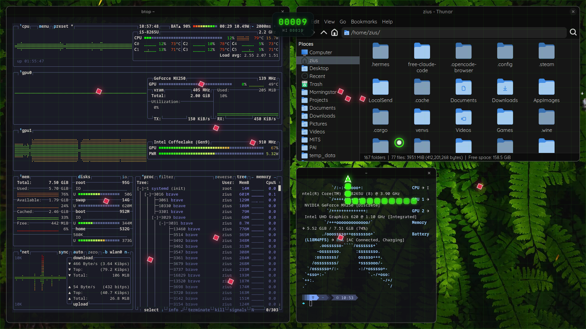
  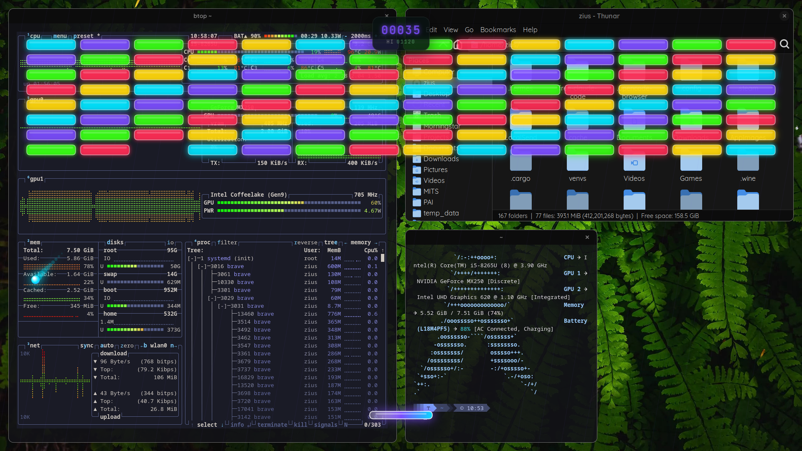
  <br />
  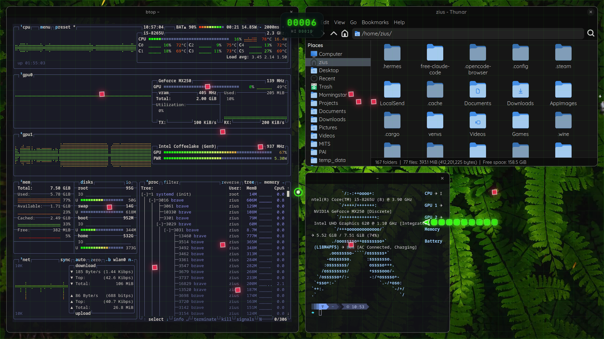
  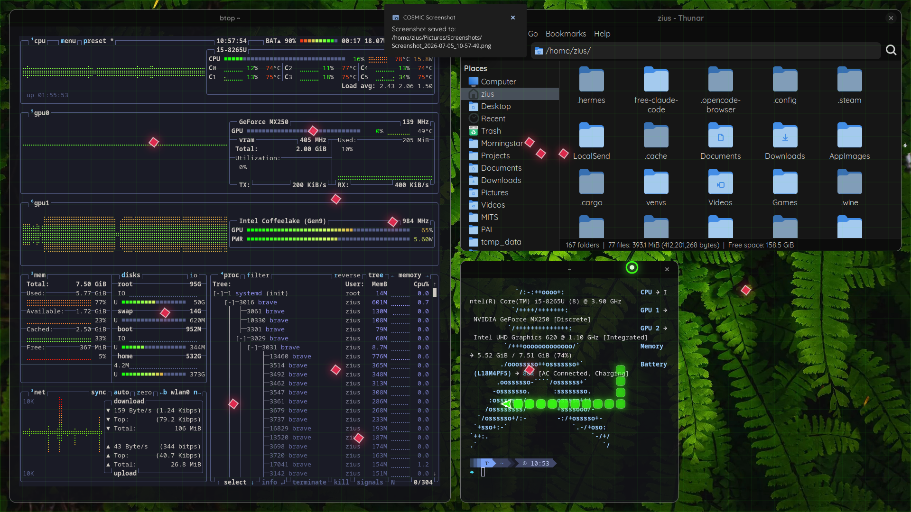
</div>
</details>

<details>
<summary><b>🐦 Flappy Bird</b> — Momentum-based flight with neon pipes</summary>
<br />
<div align="center">
  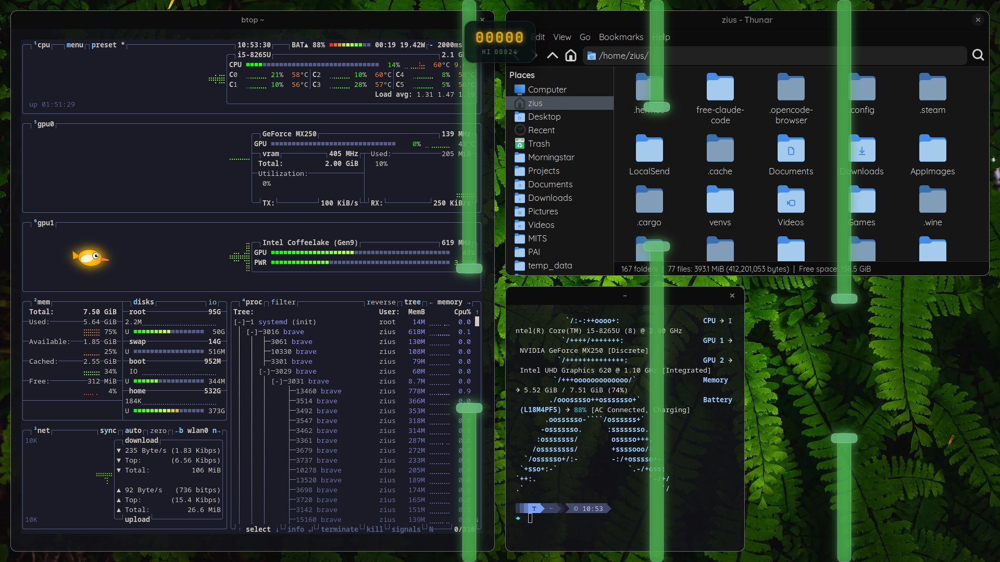
  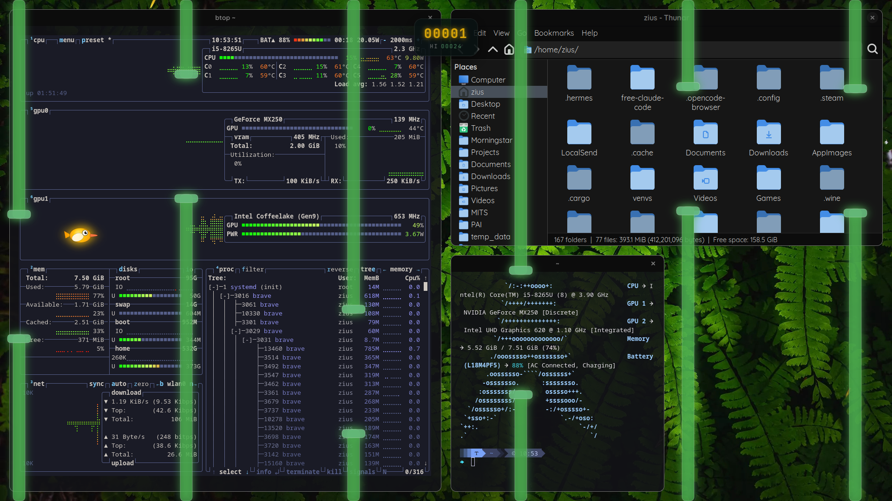
  <br />
  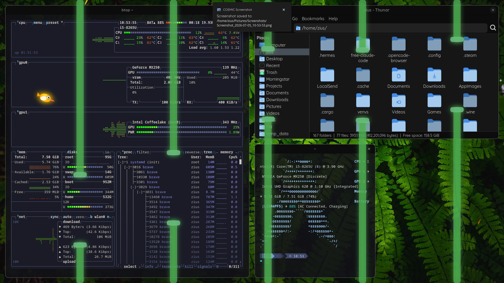
</div>
</details>

<details>
<summary><b>🌀 Gravity Runner</b> — Gravity-flip runner with spikes</summary>
<br />
<div align="center">
  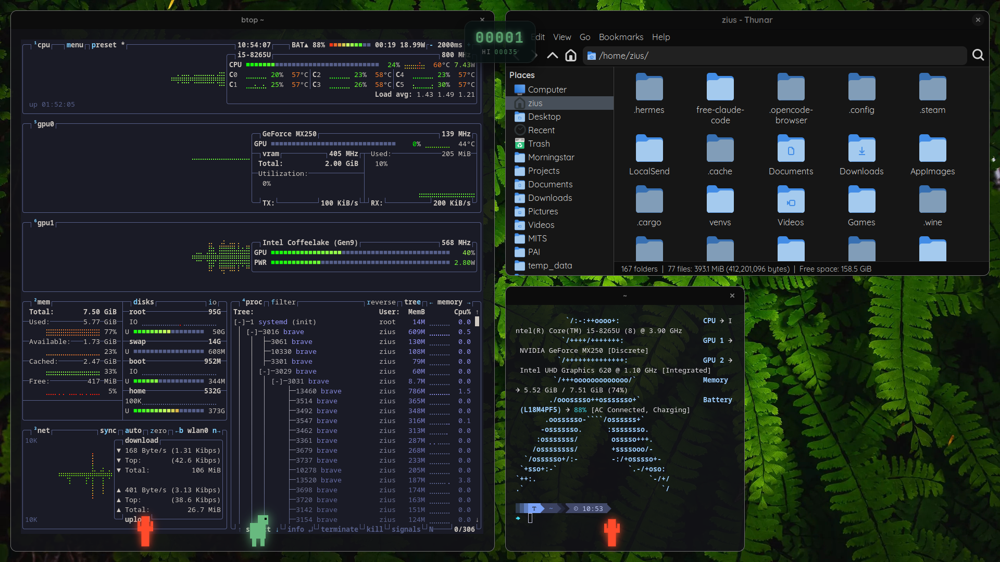
  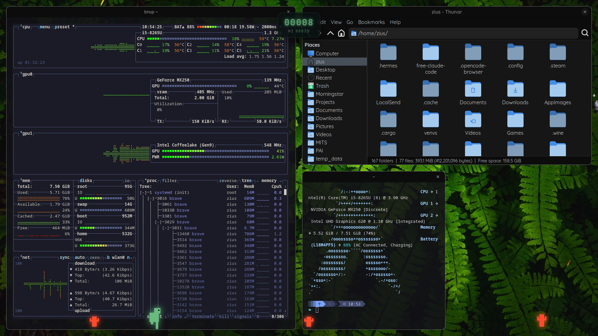
</div>
</details>

<details>
<summary><b>🛡️ Defender</b> — Side-scrolling space shooter</summary>
<br />
<div align="center">
  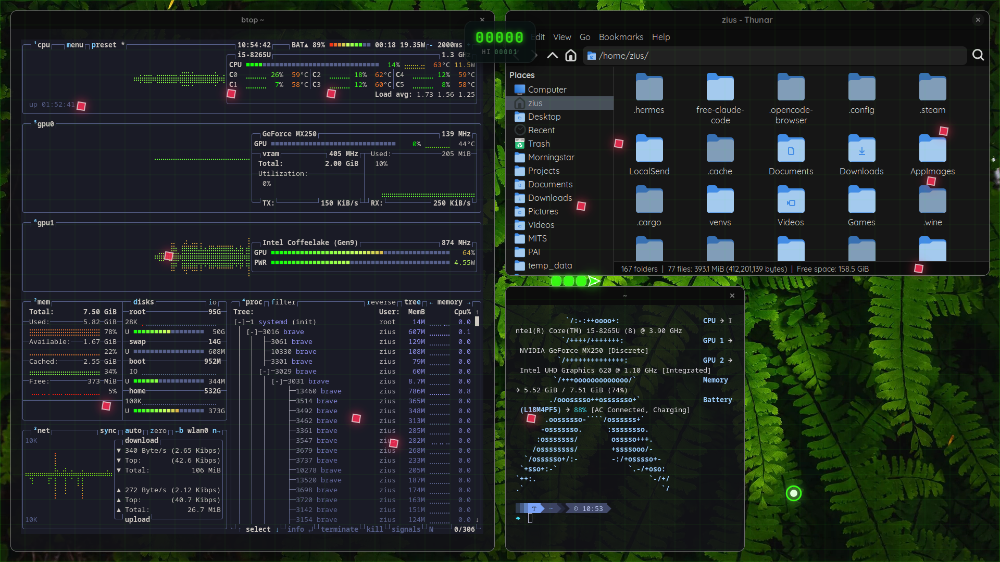
  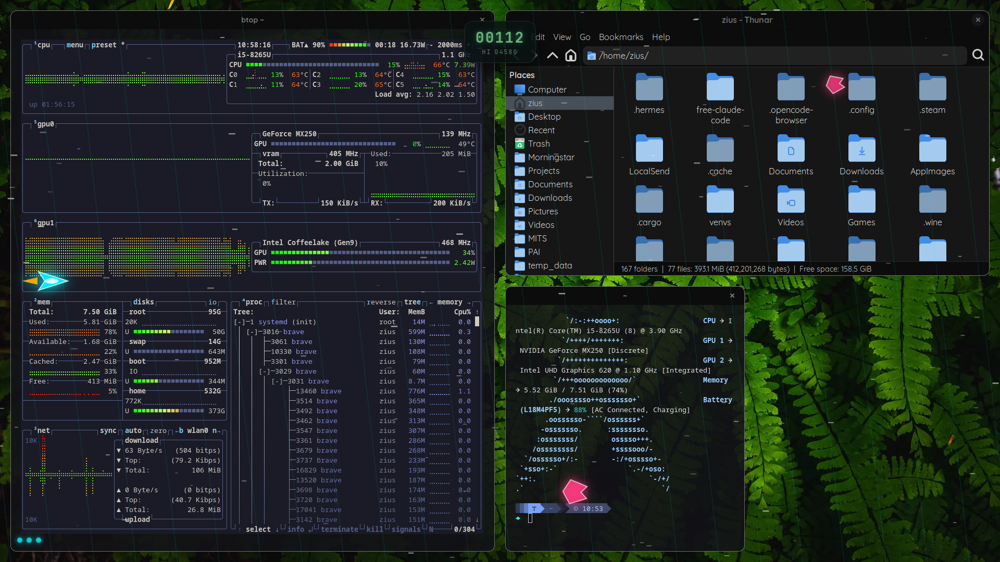
  <br />
  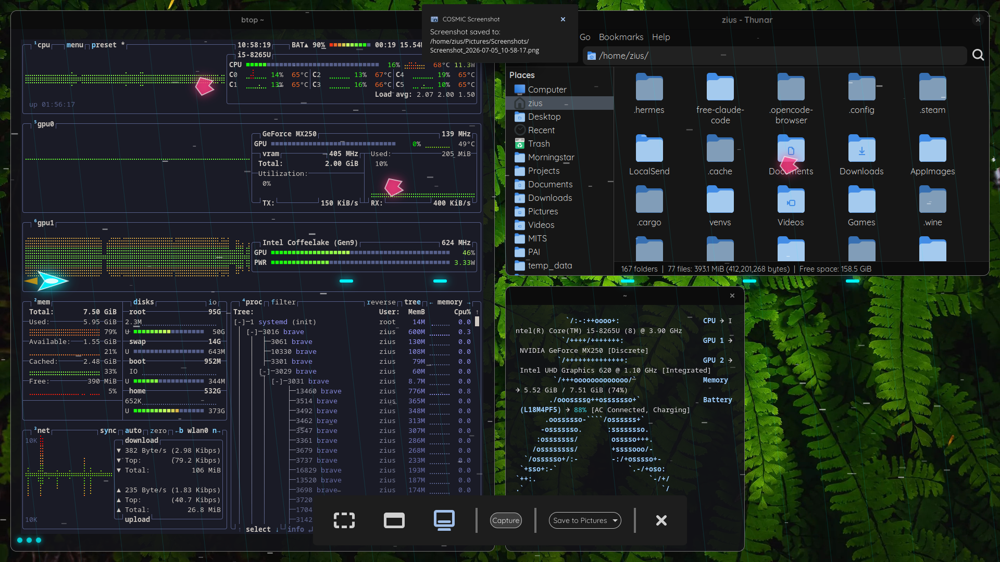
</div>
</details>

<details>
<summary><b>🐍 Cyber Snake</b> — Grid-based snake with glowing food</summary>
<br />
<div align="center">
  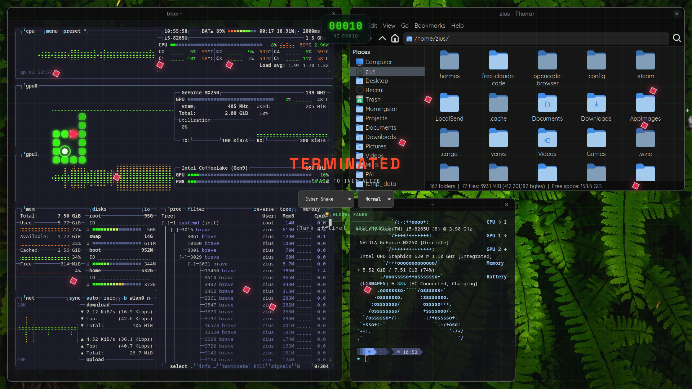
  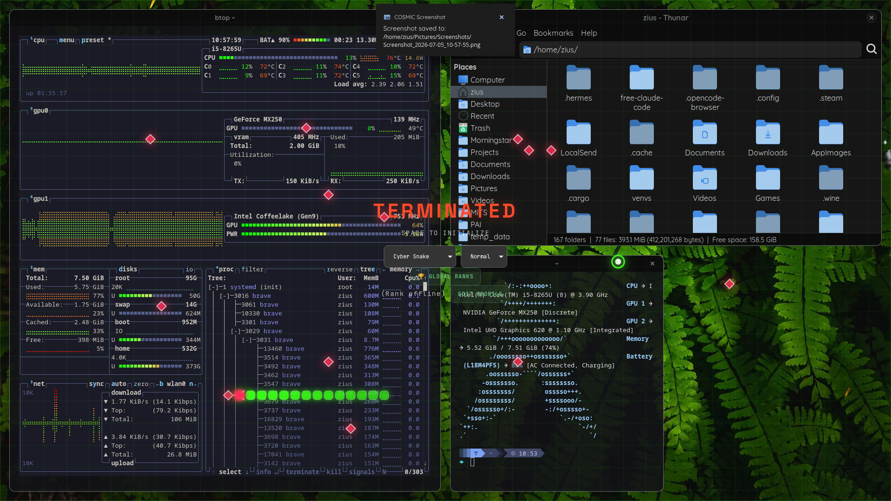
</div>
</details>

<details>
<summary><b>🧱 Neon Breakout</b> — Paddle-and-ball breakout with brick waves</summary>
<br />
<div align="center">
  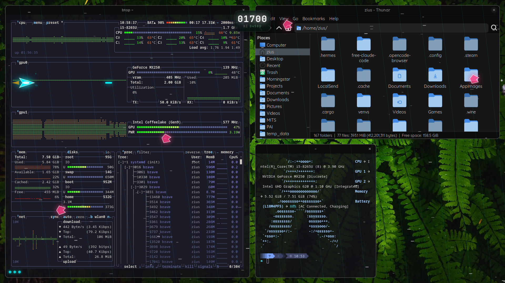
</div>
</details>

---

## Features

- **Transparent overlay** — Full-screen, no window chrome, doesn't block your desktop.
- **Always-on-top** — Available with a keypress, never lost behind other windows.
- **Six game modes** — Dino Runner, Flappy Bird, Gravity Runner, Cyber Snake, Neon Breakout, and Defender.
- **Global leaderboards** — Submit scores to a live leaderboard and track your rank across all players.
- **Dynamic difficulty** — Easy, Normal, and Hard presets with per-game speed, physics, and spacing.
- **Customizable roster** — Enable, disable, rename, and theme games through the config file.
- **Near-zero idle cost** — No CPU or RAM draw when the game isn't running.

## Installation

### Linux

```bash
# Download the latest AppImage
curl -L -o waiting-game.AppImage \
  https://github.com/ziuus/waiting-game/releases/download/v0.4.2/waiting-game_0.4.2_amd64.AppImage
chmod +x waiting-game.AppImage
./waiting-game.AppImage
```

[See other installation methods below.](#more-installation-options)

#### Toggle Binding (Hyprland)

Add this to your `hyprland.conf` to toggle the game window with a keybind:

```
bind = SUPER SHIFT, G, exec, pkill waiting-game || ~/Applications/waiting-game-0.4.2.AppImage
```

### macOS

Download the `.dmg` from [Releases](https://github.com/ziuus/waiting-game/releases/latest) (Intel and Apple Silicon).

### Windows

Download the `.exe` / `.msi` installer from [Releases](https://github.com/ziuus/waiting-game/releases/latest).

### More Installation Options

<details>
<summary>Package Manager Manifests</summary>

| OS       | Method    | Status  | Manifest                                        |
| :------- | :-------- | :------ | :---------------------------------------------- |
| Arch     | AUR       | Planned | `waiting-game-bin`                              |
| Windows  | WinGet    | Draft   | `packaging/winget/waiting-game.installer.yaml`  |
| macOS    | Homebrew  | Draft   | `packaging/homebrew/waiting-game.rb`            |
| Universal | npm      | Planned | `npx waiting-game`                              |

> Manifests exist in `packaging/` but are not published to public registries yet.
</details>

---

## Configuration

The game reads `~/.config/waiting-game/config.json` (auto-created with defaults if missing).

```json
{
  "activeGame": "dino",
  "activeDifficulty": "normal",
  "games": {
    "dino": { "enabled": true, "displayName": "Dino Runner" },
    "flappy": { "enabled": true, "displayName": "Flappy Bird" },
    "gravity": { "enabled": true, "displayName": "Gravity Runner" },
    "snake": { "enabled": true, "displayName": "Cyber Snake" },
    "breakout": { "enabled": true, "displayName": "Neon Breakout" },
    "defender": { "enabled": true, "displayName": "Defender" }
  },
  "themes": { /* per-game player, obstacle, and score colors */ },
  "difficultyModes": { /* fine-tune easy/normal/hard physics */ }
}
```

## Usage

Run the binary. The game window appears full-screen and transparent.

| Key          | Action                       |
| :----------- | :--------------------------- |
| `SPACE`      | Jump / Initialize            |
| `H`          | Hide the game window         |
| `Tab`        | Cycle controls on game-over screen |

On Linux compositors with custom keybinds (Hyprland, COSMIC), bind a hotkey to toggle the game window. See `install.sh` for an example.

---

## Game Modes

| Mode              | Description                                              |
| :---------------- | :------------------------------------------------------- |
| **Dino Runner**   | Classic runner with jump physics. Dodge cacti and birds. |
| **Flappy Bird**   | Momentum-based flight through neon pipe gaps.            |
| **Gravity Runner** | Gravity-flip runner. Navigate spikes by reversing gravity. |
| **Cyber Snake**    | Grid-based snake. Collect glowing food, avoid walls.     |
| **Neon Breakout**  | Paddle-and-ball breakout. Clear brick waves for score.   |
| **Defender**       | Side-scrolling space shooter. Destroy enemies, protect shields. |

## Tech Stack

- **Core:** Rust, Tauri v2
- **Frontend:** Vanilla JS / Canvas API
- **Leaderboard:** Firebase Firestore

---

## Development

See [CONTRIBUTING.md](CONTRIBUTING.md) for setup and contribution guidelines.

<p align="center">
  <sub>Built with ❤️ by <a href="https://github.com/ziuus">Noel Paul Tomy</a></sub>
  <br />
  <sub>MIT &mdash; see <a href="LICENSE">LICENSE</a></sub>
</p>
